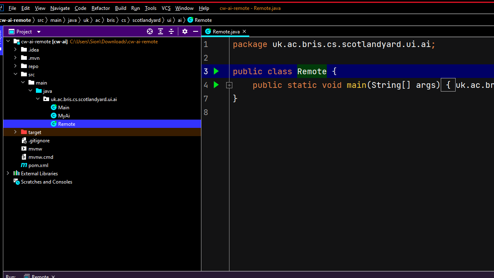
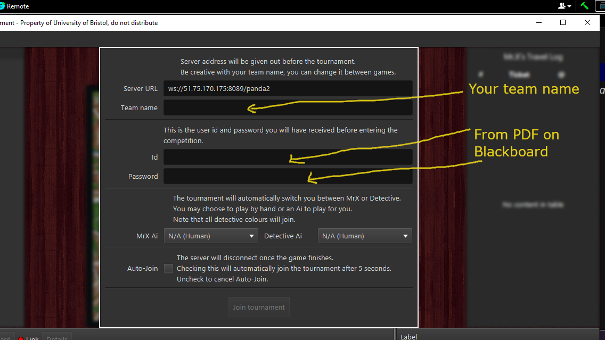

# This document explains how to port your AI to the tournament harness

* Download new harness [here]([https://mediasite.bris.ac.uk/Mediasite/Play/da355bec145b4c7fa2940738340a454a1d](https://www.ole.bris.ac.uk/bbcswebdav/courses/COMS10017_2021_TB-2/content/oo/code/cw-ai-remote.zip))
* Paste your code into MyAi.java, but you will need to start the game from Remote.java (see image below):

* Use your previous id, proivided in [this PDF](https://www.ole.bris.ac.uk/bbcswebdav/courses/COMS10017_2021_TB-2/content/oo/pdfs/useraccounts_game_server.pdf) to connect to the server 

* Make sure you can connect and view scoreboard. For m1 macs you'll need to use your browser to see the scoreboard at [this link](http://51.75.170.175:8087/)
* Attend the event on Friday 5th August 2022 (12:00 to 14:00) online or in person (MVB 2.11) Teams link [here](https://teams.microsoft.com/l/meetup-join/19%3atOLkq1oIkmZoCGLC6djvsg1x0bVc_15baQDU50U4FsA1%40thread.tacv2/1659092539021?context=%7b%22Tid%22%3a%22b2e47f30-cd7d-4a4e-a5da-b18cf1a4151b%22%2c%22Oid%22%3a%22dd2ed894-7bfc-4ec4-9dc0-91d4709b4272%22%7d)

